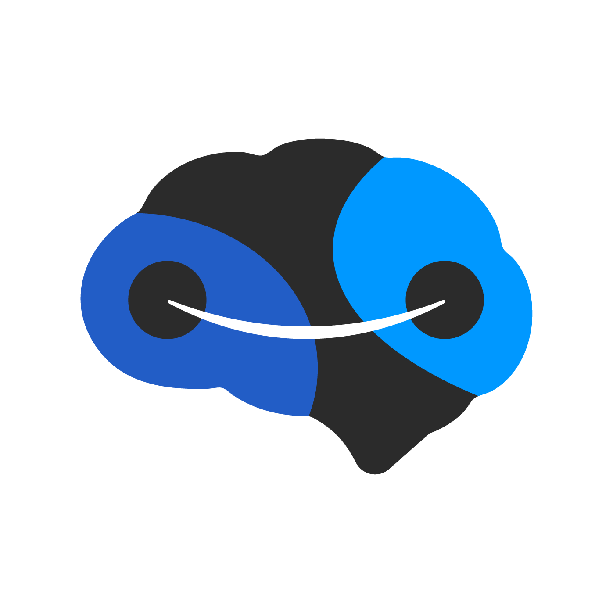

<p align="center">
  
</p>

<h1 align="center">Brain</h1>

<p align="center"><strong>Atención inteligente. Cero fricción.</strong></p>

<p align="center">
Plataforma modular con IA que atiende a tus clientes, agenda turnos y cierra ventas — 24/7.
</p>

<p align="center">
  <a href="https://brain.com.ar"></a>
  
  
</p>

---

## Sitio

Landing de una sola página, autocontenida y sin dependencias de frameworks. HTML + CSS + JS vanilla, con tipografía web, imágenes 3D y un widget de chat conectado al asistente de Brain.

## Estructura

```
brain-software-factory.github.io/
├── index.html                # Landing completa (estilos y scripts embebidos)
├── assets/
│   ├── img/
│   │   ├── brain-logo.png     # Logo / favicon / icono social
│   │   └── 3d/                # Iconografía 3D (azul de marca)
│   └── js/
│       ├── contact-form.js    # Envío del formulario de contacto
│       └── chat-widget.js     # Widget de chat flotante
├── docs/                      # Documentación interna (no se publica)
└── .github/                   # Deploy automático
```

## Identidad

| Token | Valor |
|-------|-------|
| Fondo | `#070B14` |
| Acento | `#2F80FF` → `#28C2FF` (gradiente de marca) |
| Texto | `#EAF0FB` |
| Tipografía | Onest · Spline Sans Mono |

## Desarrollo

Es un sitio estático: abrí `index.html` en el navegador o serví la carpeta con cualquier servidor estático. El deploy a producción es automático al hacer push a `main`.

---

<p align="center">© 2026 Brain · Buenos Aires, Argentina · <a href="mailto:ventas@brain.com.ar">ventas@brain.com.ar</a></p>
